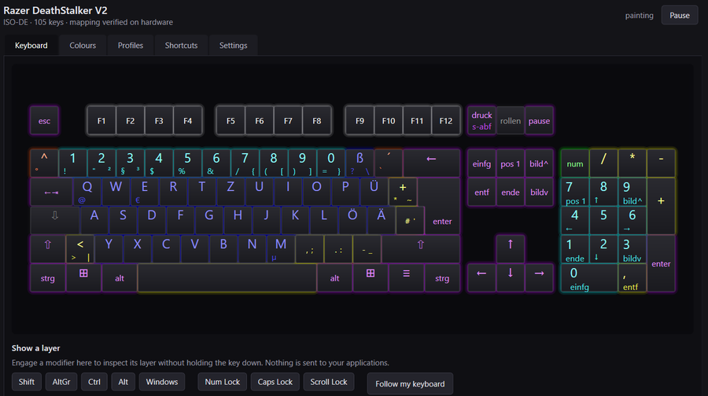

# Keylegend

**Interactieve toetsenbordverlichting voor Razer Chroma — je toetsen lichten op naar wat ze werkelijk doen.**

[English](README.md) · [Deutsch](README.de.md) · [Español](README.es.md) · [Français](README.fr.md) · [Italiano](README.it.md) · [Nederlands](README.nl.md) ·
[Polski](README.pl.md) · [Português](README.pt.md) · [Русский](README.ru.md) · [Українська](README.uk.md) · [简体中文](README.zh-cn.md)

> **Versie 1.0.0.** Verlichting, interface, gamedetectie en toepassingsprofielen werken.
> [Download het installatieprogramma of de draagbare kopie](https://github.com/Eistee82/Keylegend/releases/latest),
> of bouw vanuit de broncode. Zie [CHANGELOG.md](CHANGELOG.md).



---

## Wat het doet

De meeste RGB-software behandelt je toetsenbord als versiering. Keylegend behandelt het als een
**display**.

Elke toets krijgt de kleur van wat hij op dat *moment* betekent — en die kleur verandert zodra
zijn betekenis verandert:

- **Vergrendelingen in één oogopslag.** Num Lock, Caps Lock en Scroll Lock tonen hun toestand op
  de toets zelf.
- **Kleur per tekenklasse.** Cijfers, kleine letters, hoofdletters, symbolen en besturingstoetsen
  krijgen elk hun eigen kleur.
- **Houd een modificatietoets vast en zie de laag.** Druk op `AltGr` en alleen de toetsen die
  werkelijk een AltGr-teken dragen blijven branden. Druk op `Windows` en de Windows-sneltoetsen
  lichten op, gegroepeerd per functie. Hetzelfde voor `Alt`, `Ctrl` en hun combinaties.
- **Shift en Caps Lock werken vanzelf.** Doordat het teken dat elke toets oplevert live bij
  Windows wordt opgevraagd, springen letters uit zichzelf van de kleur «kleine letter» naar die
  van «hoofdletter». Het numerieke blok verkleurt naar navigatie zodra Num Lock uit staat.
- **Games krijgen hun eigen behandeling.** Ze worden automatisch herkend — ook in een randloos
  venster — en WASD, de toetsen eromheen en de cijferrij krijgen vaste kleuren: tijdens het
  spelen telt waar je handen liggen, niet welke letter een toets typt.
- **Profielen per toepassing, ongeveer negentig meegeleverd.** Photoshop, Visual Studio Code,
  Excel, Elden Ring en de rest treden in werking zodra het programma de focus heeft, en een
  profiel dat een programma noemt gaat vóór het algemene gameprofiel. Bewerk er één en alleen het
  bewerkte deel volgt de meegeleverde versie niet meer; de rest blijft met latere releases
  verbeteren.
- **Het geeft de verlichting terug.** Na een instelbare periode zonder activiteit (standaard
  60 s) laat Keylegend het toetsenbord los, zodat je Chroma Studio-effect het weer overneemt.
- **Elf talen.** Engels, Duits, Spaans, Frans, Italiaans, Nederlands, Pools, Portugees, Russisch,
  Oekraïens en vereenvoudigd Chinees. De interface volgt de weergavetaal van Windows en is in de
  instellingen te wijzigen. De toetsopschriften veranderen niet mee: die volgen je toetsenbord,
  niet de menu's.

Omdat de betekenis van de toetsen uit de **actieve Windows-toetsenbordindeling** komt en niet uit
een vaste tabel, werkt Keylegend met elke indeling — Nederlands, Duits, Amerikaans, Dvorak —
zonder aanpassing.

## Hoe het werkt

Keylegend vraagt Windows welk teken elke toets in de huidige toetsenbordtoestand zou opleveren
(`ToUnicodeEx`), leidt daaruit een categorie af, en stuurt de resulterende kleurenkaart naar de
Razer Chroma SDK via diens lokale REST-interface.

Het installeert bewust **geen** globale toetsenbordhook. Het leest alleen de *toestand* van
modificatie- en vergrendeltoetsen; het onderschept, verstuurt of registreert nooit een
toetsaanslag. Zie [docs/nl/architecture.md](docs/nl/architecture.md).

## Vereisten

- Windows 10 of 11
- Razer Synapse met de Chroma SDK-service actief
- Een aangesloten Razer Chroma-toetsenbord (zie hieronder)
- De .NET 10-runtime

## Installeren

```powershell
winget install Eistee82.Keylegend
```

Dat is de kortste weg: winget haalt de .NET-runtime op als opgegeven afhankelijkheid, dus er valt
niets met de hand te installeren. Anders pak je een bestand:

[**De nieuwste versie downloaden.**](https://github.com/Eistee82/Keylegend/releases/latest)

| Bestand | Wat het is |
|---|---|
| `Keylegend-1.0.0-setup.exe` | Installeert voor de huidige gebruiker — geen beheerdersrechten. Menu-item in Start, en een verwijdering die ook het opstartitem weghaalt. |
| `Keylegend-1.0.0-portable.zip` | Hetzelfde programma, om uit te pakken. Houd de map `devices` naast het uitvoerbare bestand. |

Beide zijn niet ondertekend, dus Windows noemt de uitgever onbekend — een certificaat kost per
jaar meer dan dit project heeft. Elke uitgave bevat `SHA256SUMS.txt` om de download te
controleren, en het bouwlogboek dat haar maakte is openbaar.

## Ondersteunde toetsenborden

**Elk Razer Chroma-toetsenbord.** Er is geen lijst en geen bestand per model, want Keylegend hoeft
je toetsenbord niet te herkennen — het vraagt het na. Razer Synapse beschrijft het aangesloten
toetsenbord: het model bij naam, de fysieke indeling als getal, en de toetsen die de hardware
werkelijk heeft. Razers eigen tekening van dat model levert de rest — de echte toetsafmetingen, de
behuizing met wieltje en mediatoetsen, en de contouren van de tekens die op de kappen staan, in de
juiste taal.

Het enige wat de tekening niet zegt, is bij welke cel van de lichtmatrix elke toets hoort. Dat is
een constante van het Chroma-protocol, identiek op elk model — daarom heeft ook Synapse geen tabel
per model nodig. Getoetst aan het enige met de hand gekalibreerde toetsenbord: alle 105 toetsen
kloppen.

`physicalLayout` beschrijft de *vorm* van het toetsenbord, niet de taal waarin je typt. Welk teken
een toets oplevert wordt tijdens het draaien aan Windows gevraagd, dus een Duits toetsenbord werkt
ook goed met Windows op US of Dvorak.

**Vereist Razer Synapse**, geïnstalleerd en actief, met het toetsenbord aangesloten. Daar wordt het
toetsenbord beschreven en daar staat de tekening.
## Documentatie

| Onderwerp | |
|---|---|
| Architectuur | hoe de kleuring wordt bepaald, en waarom er geen toetsenbordhook is |
| Profiel toevoegen | kleuring per toepassing |
| Configuratie | instellingen, instellingenbestand, automatisch starten |

Beschikbaar in elf talen:

[English](docs/en/) · [Deutsch](docs/de/) · [Español](docs/es/) · [Français](docs/fr/) ·
[Italiano](docs/it/) · [Nederlands](docs/nl/) · [Polski](docs/pl/) · [Português](docs/pt/) ·
[Русский](docs/ru/) · [Українська](docs/uk/) · [简体中文](docs/zh-cn/)

Engels en Duits zijn de onderhouden originelen; waar een vertaling ze tegenspreekt, is de Engelse
tekst de juiste. Correcties zijn welkom, zie [CONTRIBUTING.md](CONTRIBUTING.md).

## Bouwen en uitvoeren

```bash
git clone https://github.com/Eistee82/Keylegend.git
cd keylegend
dotnet build
dotnet test
```

`Keylegend.exe` (`src/Keylegend.App`) is het hele programma: venster, pictogram in het
systeemvak, instellingen. De ene schakelaar die het waard is: `--verify` controleert of een kopie de
meegeleverde profielen en alle elf talen bij zich heeft, schrijft de bevinding naar het daarna
opgegeven pad en antwoordt via zijn afsluitcode. Dat is wat het releasescript tegen een ingepakte
kopie uitvoert.

De instellingen staan in `%APPDATA%\Keylegend\settings.json` en worden door de toepassing
geschreven.

## Bijdragen

Foutmeldingen, toepassingsprofielen en vertalingen zijn allemaal welkom — zie
[CONTRIBUTING.md](CONTRIBUTING.md) en [CODE_OF_CONDUCT.md](CODE_OF_CONDUCT.md).

## Licentie

[MIT](LICENSE). Twee donatieknoppen van derden zijn uitgezonderd, en er staat hier geen code,
header, bibliotheek of beeldmateriaal van een fabrikant — zie [NOTICE.md](NOTICE.md).

## Merkenvermelding

Dit project is **niet verbonden aan Razer Inc. en wordt door Razer niet onderschreven of
gesponsord.**

RAZER en RAZER CHROMA zijn handelsmerken of gedeponeerde handelsmerken van Razer Inc. Ze worden
hier uitsluitend gebruikt om de hardware en de software-interface aan te duiden waarmee dit
project samenwerkt, zoals refererend gebruik toestaat. Keylegend is een onafhankelijk project dat
door de gemeenschap wordt onderhouden.

Hetzelfde geldt voor elke andere naam in deze repository. De toepassings- en gameprofielen noemen
ongeveer negentig programma's — Photoshop, Visual Studio Code, Excel, Elden Ring en meer — en de
documentatie noemt toetsenbordfabrikanten en -modellen. Dat zijn handelsmerken van hun respectieve
houders en ze staan er alleen om te zeggen voor welk programma of welk toetsenbord iets bedoeld is.
Keylegend is met geen van hen verbonden en bevat noch hun code noch hun materiaal. Zie
[NOTICE.md](NOTICE.md).