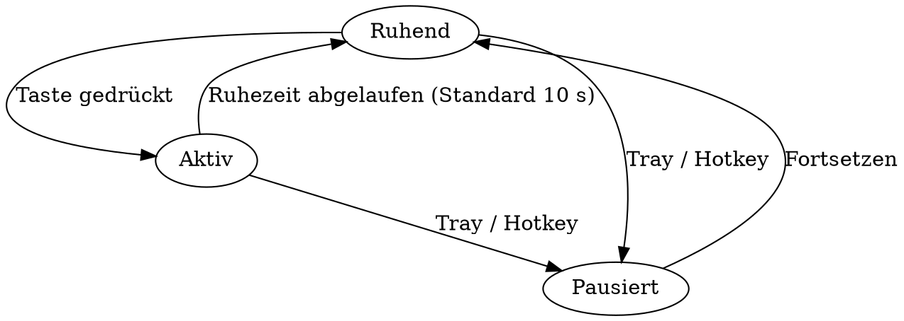

# Keylegend — Entwurf

**Datum:** 2026-08-10
**Status:** Freigegeben, bereit zur Planung

> Dies ist das Entwurfsdokument, das der Umsetzung zugrunde liegt. Es hält auch die
> Begründungen und die Messwerte fest, die zu den Entscheidungen geführt haben.
> Anwendungsnahe Dokumentation steht in `docs/de/` und `docs/en/`.

## 1. Ziel

Eine Windows-Anwendung, die die Tastaturbeleuchtung als **Funktionsanzeige** nutzt statt als Dekoration. Die Tasten werden nach ihrer aktuellen Bedeutung eingefärbt, und diese Einfärbung ändert sich in dem Moment, in dem sich die Bedeutung ändert — also beim Drücken von Modifiern und beim Umschalten der Lock-Zustände.

Kernanforderungen:

- Statusanzeige für NumLock, CapsLock und Rollen an der jeweiligen Taste
- Grundeinfärbung nach Zeichenkategorie: Ziffern, Kleinbuchstaben, Großbuchstaben, Sonderzeichen, Steuertasten
- Kontextabhängige Anzeige: Bei gedrücktem Modifier leuchten nur noch Tasten, die in diesem Kontext eine Belegung haben
- Shortcut-Ebenen für Win, Alt, Strg und deren Kombinationen, nach Funktionsgruppen eingefärbt
- Überschreibbarkeit durch anwendungsspezifische Profile
- Rückgabe der Beleuchtung an Chroma Studio nach einer einstellbaren Ruhezeit

## 2. Umgebung

Verifiziert auf dem Zielsystem (Windows 11 Pro 26200):

| Komponente | Stand |
|---|---|
| Razer Chroma SDK Server | läuft als Dienst, REST-API unter `http://localhost:54235/razer/chromasdk` erreichbar |
| .NET SDK | 10.0.302 |
| Tastatur | Razer Deathstalker V2, deutsches ISO-Layout |
| Layout-Datei | `Deathstalker V2 GER.xml` (RGB.NET-Format, 106 LEDs, ISO-korrigiert) |

**Technologie:** C# / .NET 10 mit WPF. Begründung: direkter Zugriff auf die benötigten Windows-Funktionen, schlanker Dauerbetrieb im Hintergrund, Auslieferung als einzelne ausführbare Datei, Tray-Integration und Autostart ohne Zusatzbibliotheken.

### 2.1 Gemessene Latenzen der Chroma-API

Diese Werte bestimmen den Entwurf der Session-Verwaltung und wurden auf dem Zielsystem gemessen:

| Vorgang | Dauer |
|---|---|
| Session anlegen (`POST /razer/chromasdk`) | 60–125 ms |
| Erster Frame, während Chroma Studio aktiv ist | **~500 ms** |
| Erster Frame, wenn kurz zuvor eine Session lief | ~3 ms |
| Weitere Frames (`PUT {uri}/keyboard`) | **~2 ms** |
| Session beenden (`DELETE {uri}`) | ~2 ms |

Die halbe Sekunde entsteht ausschließlich bei der „kalten" Übernahme von einem laufenden Studio-Effekt. Innerhalb einer offenen Session sind ~2 ms pro Frame erreichbar, also weit mehr als nötig.

Bestätigt: Nach `DELETE` übernimmt Chroma Studio den konfigurierten Effekt wieder selbsttätig.

### 2.2 Protokolldetails

- Farbwerte sind **BGR**-kodierte Ganzzahlen: `(B << 16) | (G << 8) | R`
- Vollbild-Ansteuerung über `{"effect":"CHROMA_CUSTOM","param":[[…22 Werte…] × 6]}`
- Die Session benötigt einen Heartbeat (`PUT {uri}/heartbeat`) in Abständen unter 10 s

## 3. Architektur

Leitgedanke: Die gesamte Entscheidungslogik ist eine **reine Berechnung** ohne Zugriff auf Windows, Netzwerk oder Dateisystem:

```
(Tastaturzustand, Layout, Profil, Farbkonfiguration) → Farbe je Taste
```

Daraus folgen zwei Eigenschaften, die den Entwurf tragen:

1. Die Tastatur-Vorschau in der Oberfläche und die echte Tastatur werden von **demselben Code** befüllt. Was im Fenster zu sehen ist, leuchtet auch.
2. Die Logik ist vollständig testbar, ohne dass eine Tastatur angeschlossen oder Synapse installiert sein muss.

Alles, was mit der Außenwelt spricht, liegt in dünnen Adaptern darum herum.

| Komponente | Aufgabe | Abhängigkeit |
|---|---|---|
| `StateReader` | fragt Modifier- und Lock-Zustände ab, meldet Änderungen | Windows |
| `LayoutProvider` | liest das Layout-XML → Tastenliste mit Position, Größe, LedId | Dateisystem |
| `KeyResolver` | ermittelt per `ToUnicodeEx`, welches Zeichen eine Taste im aktuellen Zustand erzeugt | Windows |
| `Classifier` | Zeichen → Kategorie | keine |
| `ShortcutSets` | Shortcut-Sätze je Modifier-Kombination, mit Funktionsgruppen | keine |
| `AppWatcher` | Vordergrundprogramm für die Profilwahl | Windows |
| **`FrameComposer`** | **der reine Kern: erzeugt das Farbbild** | **keine** |
| `SessionManager` | Zustandsautomat für Übernahme und Rückgabe der Beleuchtung | — |
| `ActivityTracker` | erkennt Tastaturaktivität und Ruhezeit | Windows |
| `ChromaClient` | REST-Anbindung samt Heartbeat, hinter einer Schnittstelle | Netzwerk |
| `MatrixMap` | Taste → Zeile/Spalte in Razers Matrix | keine |
| `ConfigStore` | Farben, Shortcut-Sätze und Profile laden und speichern | Dateisystem |
| `UI` (WPF) | Vorschau, Farbwähler, Editoren, Tray | — |

**Datenfluss:** `ActivityTracker`/`StateReader` erkennen eine Änderung → `FrameComposer` berechnet das Farbbild → `ChromaClient` sendet es und die Vorschau zeigt es. Ohne Änderung wird nichts gesendet außer dem Heartbeat.

### 3.1 Erfassung des Tastaturzustands

Bewusst **ohne globalen Tastatur-Hook**. Ein solcher Hook wäre funktional ein Keylogger, greift in die Eingabekette ein und fällt bei Anticheat-Systemen negativ auf.

Stattdessen wird der Zustand der benötigten Tasten zyklisch abgefragt (`GetAsyncKeyState` für gedrückte Modifier, `GetKeyState` für Lock-Zustände), etwa 60-mal pro Sekunde. Neu gezeichnet wird ausschließlich bei einer Änderung. Es werden keine Tastenanschläge abgefangen, weitergeleitet oder gespeichert — nur Zustände gelesen.

Für das Aufwecken aus dem Ruhezustand wird zusätzlich geprüft, ob überhaupt eine Taste gedrückt ist; auch das über Zustandsabfrage, beschränkt auf die im Layout vorhandenen Tasten.

### 3.2 Linke und rechte Modifier

Windows meldet **AltGr als Kombination aus Strg und rechtem Alt**. Zusätzlich ist auf deutschen Layouts Strg + linkes Alt gleichbedeutend mit AltGr, erzeugt also dieselben Zeichen.

Festlegung zur Auflösung:

- **rechtes Alt gedrückt** → AltGr-Ebene, es wird die *Zeichenbelegung* angezeigt
- **Strg + linkes Alt** → Shortcut-Satz `Strg+Alt` (z. B. Strg+Alt+Entf)

Die Zustandsabfrage muss daher linke und rechte Varianten getrennt auswerten (`VK_LMENU`/`VK_RMENU`, `VK_LCONTROL`/`VK_RCONTROL`, `VK_LSHIFT`/`VK_RSHIFT`, `VK_LWIN`/`VK_RWIN`).

## 4. Anzeigelogik

Die Farbe einer Taste ergibt sich aus drei Regeln in dieser Rangfolge:

### Regel 1 — Lock-Zustände (höchste Priorität)

NumLock, CapsLock und Rollen zeigen an ihrer eigenen Taste ihren Zustand. Je Lock-Taste sind zwei Farben konfigurierbar — eine für „eingeschaltet", eine für „ausgeschaltet" — mit einer kräftigen Signalfarbe und einer gedimmten Variante als Vorgabe.

Diese Anzeige hat Vorrang vor allen anderen Regeln und wird auch dann nicht überschrieben, wenn ein filternder Modifier aktiv ist. Damit bleibt der Lock-Zustand jederzeit ablesbar.

### Regel 2 — Modifier-Ebene

Modifier zerfallen in zwei Klassen, und die Unterscheidung ist wesentlich:

**Filternde Modifier** — AltGr, Win, Alt, Strg und deren Kombinationen. Solange einer davon gedrückt ist, leuchten **nur** Tasten mit Belegung in diesem Kontext; alle übrigen bleiben dunkel.

- **AltGr**: Die Belegung stammt aus dem Tastaturlayout. Belegte Tasten werden nach der Kategorie des *dann erzeugten* Zeichens eingefärbt (Regel 3), also etwa `@`, `€` oder `\|` als Sonderzeichen.
- **Win / Alt / Strg / Kombinationen**: Die Belegung stammt aus dem passenden Shortcut-Satz, eingefärbt nach Funktionsgruppe.

**Nicht filternde Modifier** — Shift, CapsLock und NumLock. Sie blenden nichts aus, sondern verändern lediglich, welches Zeichen eine Taste erzeugt. Die Grundeinfärbung nach Regel 3 bleibt für alle Tasten aktiv; Buchstaben wechseln dabei von der Farbe für Kleinbuchstaben auf die für Großbuchstaben, die Zahlenreihe auf Sonderzeichen und so fort.

**Kombination beider Klassen**: Ist gleichzeitig ein filternder und ein nicht filternder Modifier gedrückt (etwa Shift+AltGr), gilt der Filter des filternden Modifiers, und die Belegung wird für den vollständigen Zustand einschließlich Shift ermittelt.

### Regel 3 — Grundeinfärbung nach Kategorie

Je eine konfigurierbare Farbe für:

| Kategorie | Beispiel |
|---|---|
| Ziffer | `1`, `7`, Ziffernblock bei aktivem NumLock |
| Kleinbuchstabe | `a`, `ö` |
| Großbuchstabe | `A`, `Ö` |
| Sonderzeichen | `+`, `#`, `€`, `\|` |
| Steuertaste | Esc, Tab, Enter, Rücktaste, Modifier, F-Tasten, Pfeile, Einfg/Entf/Pos1/Ende/Bild |
| Tote Taste | `^`, `´`, `` ` `` |
| ohne Belegung | dunkel |

**Shift, CapsLock und NumLock brauchen keine Sonderbehandlung.** Da `ToUnicodeEx` mit dem vollständigen aktuellen Tastaturstatus aufgerufen wird, liefert dieselbe Taste bei gedrücktem Shift `A` statt `a` und fällt damit automatisch in die Kategorie „Großbuchstabe". Ebenso erzeugt der Ziffernblock bei ausgeschaltetem NumLock Navigationsbefehle und wird dadurch selbsttätig als Steuertaste eingefärbt. Aus demselben Grund funktioniert die Anwendung unverändert, wenn ein anderes Tastaturlayout aktiv ist.

Tote Tasten meldet `ToUnicodeEx` über einen eigenen Rückgabewert und erhalten deshalb eine eigene Farbe.

## 5. Shortcut-Sätze

Ein Shortcut-Satz ist eine Zuordnung `Taste → Funktionsgruppe`, nachgeschlagen über die Menge der aktiven Modifier. Dadurch sind alle Kombinationen dieselbe Datenstruktur und neue Ebenen erfordern keine Codeänderung.

Von Anfang an befüllt werden: `Win`, `Win+Shift`, `Win+Strg`, `Alt`, `Strg`, `Strg+Shift`, `Strg+Alt`.

### Win

| Gruppe | Tasten |
|---|---|
| Starten / Öffnen | E (Explorer), R (Ausführen), S und Q (Suche), T (Taskleiste), 1–9 (angeheftete Programme) |
| Fenster / Desktop | D (Desktop), M (minimieren), Pfeile (andocken), Tab (Task-Ansicht), Z (Snap-Layouts), Pos1 |
| System / Einstellungen | I (Einstellungen), X (Power-Menü), A (Schnelleinstellungen), N (Benachrichtigungen), U (Barrierefreiheit), L (sperren), Pause |
| Werkzeuge / Eingabe | V (Zwischenablageverlauf), Punkt (Emoji), H (Diktat), G (Game Bar), P (Projizieren), K (Verbinden), C (Copilot), W (Widgets) |
| Ansicht | Plus/Minus (Bildschirmlupe), Esc |

### Weitere Ebenen

| Ebene | Inhalt |
|---|---|
| Win+Shift | S (Ausschnitt), Pfeile (Fenster auf anderen Monitor) |
| Win+Strg | D (neuer Desktop), F4 (Desktop schließen), Pfeile (Desktop wechseln) |
| Alt | Tab (Fensterwechsel), F4 (schließen), Pfeile (vor/zurück), Pos1 |
| Strg | Bearbeiten (X/C/V/Z/Y/A), Datei (N/O/S/P/W), Suchen und Navigation (F/H/G, Pos1/Ende, Pfeile), Ansicht (T/Tab/+/−/0) |
| Strg+Shift | Esc (Task-Manager), N (neuer Ordner), T (Tab wiederherstellen), V (unformatiert einfügen) |
| Strg+Alt | Entf (Sicherheitsoptionen) |

Strg-Shortcuts sind anwendungsabhängig; der mitgelieferte Satz bildet die verbreiteten Windows-Standards ab. Win-Shortcuts sind systemweit fest vergeben und damit immer zutreffend.

### Anwendungsprofile

Ein Profil ist einem Programm zugeordnet (erkannt über das Vordergrundfenster) und kann einzelne Ebenen ergänzen oder vollständig ersetzen. Greift kein Profil, gilt der Standardsatz.

## 6. Betriebszustände



| Zustand | Verhalten |
|---|---|
| **Ruhend** | Keine Session. Chroma Studio steuert die Beleuchtung. Es läuft nur die sparsame Aktivitätsabfrage. |
| **Aktiv** | Session offen, Heartbeat läuft, neue Frames bei jeder Zustandsänderung. |
| **Pausiert** | Session freigegeben, keine Übernahme bis zum Fortsetzen. |

Die Ruhezeit ist in der Oberfläche einstellbar (Vorgabe 10 s). Beim Wechsel nach *Ruhend* wird die Session sauber per `DELETE` beendet, damit Chroma Studio sofort übernimmt.

Beim ersten Tastendruck nach einer Ruhephase entsteht die gemessene Verzögerung von rund einer halben Sekunde. Das ist eine bewusst akzeptierte Eigenschaft dieses Ansatzes: Während des Tippens bleibt die Session offen, sodass die Verzögerung im laufenden Betrieb nicht auftritt.

## 7. Oberfläche

- **Tastatur-Vorschau**: maßstabsgetreu aus dem Layout-XML gezeichnet, live eingefärbt durch denselben `FrameComposer` wie die echte Tastatur
- **Anklickbare Modifier**: Shift, Strg, Alt, AltGr und Win lassen sich in der Vorschau umschalten, um eine Ebene zu betrachten, ohne die Taste halten zu müssen
- **Farbwähler** je Kategorie und je Funktionsgruppe
- **Editor für Shortcut-Sätze**: Tasten einer Funktionsgruppe zuordnen
- **Profilverwaltung**: Programm auswählen, Ebenen überschreiben
- **Einstellungen**: Ruhezeit in Sekunden, globale Helligkeit (Faktor von 0 bis 100 %, der beim Erzeugen des Farbbilds auf alle Farben angewandt wird), Autostart
- **Testmodus** für die Matrix-Zuordnung (siehe Abschnitt 9)
- **Tray-Icon**: Pausieren/Fortsetzen, Fenster öffnen, Beenden; Autostart über den Registry-Schlüssel `Run`

## 8. Konfiguration

Farben, Shortcut-Sätze und Profile werden als JSON unter `%APPDATA%` abgelegt und über die Oberfläche bearbeitet. Beim Start wird eine vollständige Standardkonfiguration erzeugt, falls keine vorhanden ist.

## 9. Zuordnung Taste → Matrixzelle

Die Chroma-API adressiert die Tastatur als Raster aus 6 Zeilen und 22 Spalten. Die Zuordnung stammt aus Razers eigenen `RZKEY_*`-Konstanten (`RzChromaSDKTypes.h`), die jede Taste als `0xRRCC` kodieren — Zeile im oberen, Spalte im unteren Byte.

Für das deutsche ISO-Layout sind zwei Zellen entscheidend, die im US-Layout nicht vorkommen:

| Taste | Kennung | Zelle |
|---|---|---|
| `#` neben der Eingabetaste | `Keyboard_NonUsTilde` | `RZKEY_EUR_1`, Zeile 3 Spalte 13 |
| `<>\|` links neben Y | `Keyboard_NonUsBackslash` | `RZKEY_EUR_2`, Zeile 4 Spalte 2 |

Die zweiteilige ISO-Eingabetaste belegt zwei Zellen: oben `Keyboard_Backslash` (Zeile 2, Spalte 14), unten `Keyboard_Enter` (Zeile 3, Spalte 14).

Die Zuordnung wird als Daten geführt, nicht im Code verdrahtet. Der **Kalibrierungsmodus** in der Oberfläche schaltet die Zellen einzeln durch, sodass ein Profil an echter Hardware überprüft und bei Bedarf korrigiert werden kann. Erst nach einer solchen Bestätigung wird `verified` gesetzt.

## 9a. Open-Source-Rahmen

Das Projekt wird unter dem Namen **Keylegend** veröffentlicht, Untertitel „Interactive keyboard lighting for Razer Chroma", unter der **MIT-Lizenz**.

### Namenswahl

„Razer" und „Razer Chroma" sind Marken der Razer Inc. Ihre Markenrichtlinien erlauben die *referenzielle* Nennung zur Bezeichnung von Razer-Produkten, untersagen aber ausdrücklich die Verwendung als Bestandteil eines Marken-, Domain- oder Projektnamens sowie verwechselbar ähnliche Zeichen. Der Projektname enthält daher keine Marke; der Bezug steht in Untertitel, Beschreibung und Repository-Themen, wo Suchmaschinen ihn auswerten. Der geforderte Markenhinweis steht in beiden READMEs.

Gegen den ursprünglich erwogenen Namen „ChromaKeyStatus" sprach zusätzlich, dass „Chroma Key" der etablierte Fachbegriff für Greenscreen-Technik ist — der Name wäre zwischen Videobearbeitungssoftware untergegangen.

### Geräteprofile als Daten

Eine Tastatur wird durch zwei Dateien beschrieben: `device.json` (Metadaten, Geometrie, Matrixzuordnung) und ein Bild. Neue Modelle erfordern **keine Codeänderung**. Ein Konvertierungswerkzeug (`tools/convert-rgbnet-layout.ps1`) erzeugt aus vorhandenen RGB.NET- oder Artemis-Layouts ein Profilgerüst.

Ein Validierer prüft jedes Profil auf eindeutige Kennungen, kollidierende Matrixzellen, Zellen außerhalb der Matrix, Tasten außerhalb der Zeichenfläche und fehlende Bilder. Diese Prüfung läuft in der CI, sodass ein fehlerhaftes Profil nicht übernommen werden kann.

### Mehrsprachigkeit

Dokumentation und Oberfläche liegen zunächst auf Englisch und Deutsch vor. Oberflächentexte werden als Ressourcendateien geführt, Dokumentation in `docs/<sprachkürzel>/`. Fehlende Übersetzungen fallen auf Englisch zurück, sodass Teilübersetzungen möglich sind.

### Continuous Integration

GitHub Actions übersetzt und testet bei jedem Push und Pull Request auf `windows-latest` — die Anwendung ist Windows-spezifisch. Die Geräteprofilprüfung ist Teil des Testlaufs.

## 10. Fehlerbehandlung

| Fall | Verhalten |
|---|---|
| Chroma-Server nicht erreichbar (Synapse startet neu oder aktualisiert sich) | Wechsel nach *Ruhend*, erneute Versuche mit wachsenden Abständen; die Anwendung bleibt bedienbar |
| Session bricht ab oder Heartbeat schlägt fehl | Session verwerfen und beim nächsten Bedarf neu anlegen |
| Layout-XML fehlt oder ist fehlerhaft | Klare Meldung in der Oberfläche statt stillem Nichtstun |
| Unbekannte Taste ohne Matrixzuordnung | Taste wird übersprungen und im Testmodus als nicht zugeordnet ausgewiesen |

## 11. Teststrategie

Testbar ohne Hardware, weil die Entscheidungslogik keine Außenanbindung hat:

- `Classifier`: Zeichen → erwartete Kategorie, einschließlich Umlauten, toten Tasten und Ziffernblock
- `ShortcutSets`: Nachschlagen über Modifier-Mengen, Vorrang von Profilen vor Standardsatz
- `FrameComposer`: feste Zustands-Eingaben → erwartetes Farbbild; deckt die Rangfolge der drei Regeln ab, insbesondere den Vorrang der Lock-Anzeige
- Modifier-Auflösung: rechtes Alt ergibt AltGr-Ebene, linkes Alt mit Strg ergibt den Shortcut-Satz
- `SessionManager`: Zustandsübergänge mit gesteuerter Zeitquelle, ohne echtes Warten
- `ChromaClient`: liegt hinter einer Schnittstelle und wird in Tests durch eine Attrappe ersetzt

## 12. Empfohlene Umsetzungsreihenfolge

Der Entwurf ist umfangreich genug, dass die Reihenfolge festgehalten sein sollte. Leitgedanke: möglichst früh etwas auf der echten Tastatur sichtbar machen, weil die Matrix-Zuordnung ohnehin praktisch verifiziert werden muss.

| Schritt | Inhalt | Ergebnis |
|---|---|---|
| 1 | `LayoutProvider`, `ChromaClient`, `MatrixMap` samt Durchschalt-Werkzeug | Einzelne Tasten lassen sich gezielt ansteuern; die Zuordnung wird verifiziert |
| 2 | `StateReader`, `KeyResolver`, `Classifier`, `FrameComposer` | Grundeinfärbung nach Kategorie leuchtet, Shift und die Lock-Zustände wirken |
| 3 | `SessionManager`, `ActivityTracker` | Übernahme bei Aktivität, Rückgabe an Chroma Studio nach Ruhezeit |
| 4 | `ShortcutSets` und Modifier-Ebenen | AltGr-, Win-, Alt- und Strg-Ansicht |
| 5 | Oberfläche: Vorschau und Testmodus | Sichtbare Kontrolle, Zuordnung korrigierbar |
| 6 | Oberfläche: Farbwähler, Editoren, `AppWatcher` und Profile | Vollständige Konfigurierbarkeit |
| 7 | Tray-Icon, Autostart, `ConfigStore` | Alltagstauglicher Dauerbetrieb |

Nach Schritt 2 ist die Anwendung bereits nützlich; die späteren Schritte bauen darauf auf, ohne den Kern zu verändern.

## 13. Bewusst nicht enthalten

| Ausgeschlossen | Grund |
|---|---|
| Vorwärmen bei Mausbewegung | Vom Anwender verworfen |
| fn als Modifier | Wird von der Tastatur-Firmware verarbeitet und ist für Windows voraussichtlich unsichtbar; zurückgestellt. Dank der generischen Struktur der Shortcut-Sätze jederzeit nachrüstbar |
| Effekte im Ruhezustand (eigener Farbverlauf) | Übernimmt Chroma Studio |
| Tipp-Animationen (Wellen o. Ä.) | Nicht gefordert |
| Unterstützung weiterer Geräte (Maus, Mauspad) | Nicht gefordert; die Architektur steht dem aber nicht im Weg |
